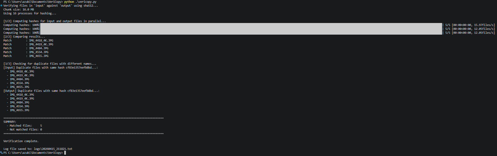
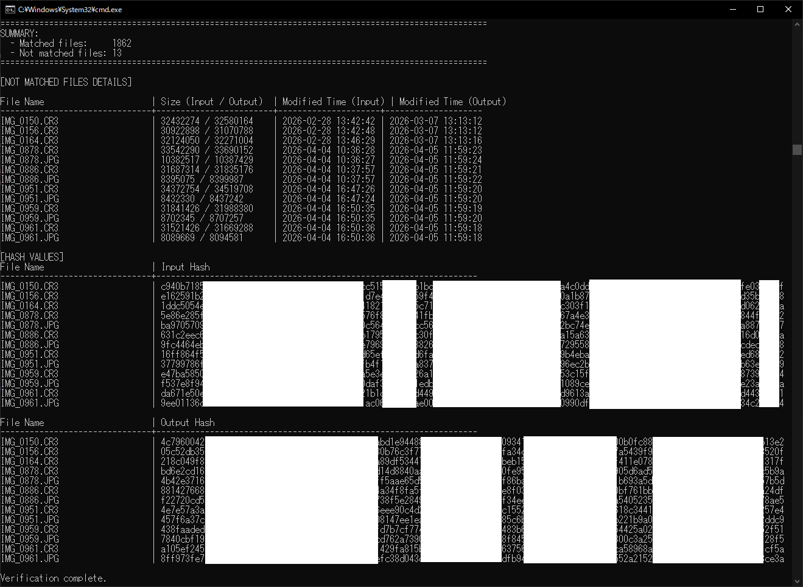

# VeriCopy
I don’t want to lose even a single photo of my child.
However, We don't have the money or space to keep expanding our storage indefinitely.

## Overview
Verify the files in the folder under my supervision to confirm that they have been copied correctly from the SD card to the hard disk drive.

## Operation confirmation
|OS|CPU|RAM|Python|
|--|---|---|------|
|Windows 10 Pro|Ryzen Threadripper 1950X|32GB|3.10.11|
|Windows 11 Home 25H2|12Gen Core i5 1240P|16GB|3.9.13|

## Requirements

### Python Version
- **Minimum**: Python 3.8.0 or later
- **Recommended**: Python 3.11 or later (latest available)

### Supported Python Versions
- Python 3.8, 3.9, 3.10, 3.11+ (confirmed working)

### Dependencies
- tqdm >= 4.66.3

### ⚠️ Security Notice

To avoid critical vulnerabilities with CVSS scores of 7.0 or higher, please use the following minimum versions:

**Python Security Patches (CVSS 7.0+)**
- Python 3.8: 3.8.20 or later recommended
- Python 3.9: 3.9.20 or later recommended
- Python 3.10: 3.10.13 or later recommended
- Python 3.11+: Latest version recommended

**External Package Security**
- tqdm: **4.66.3 or later is required** to patch CVE-2024-34062 (arbitrary code execution vulnerability)

It is strongly recommended to keep your Python environment and all dependencies updated to the latest versions to maintain security.

## Screenshots of the execution result
### Exec command
```
python vericopy.py
```

### Success


### NotMatch


## For developers
1. 1st step  
These folders are only valid locally and do not sync with Git.
```
mkdir input
mkdir output
mkdir logs
```

2. 2nd step  
Develop!